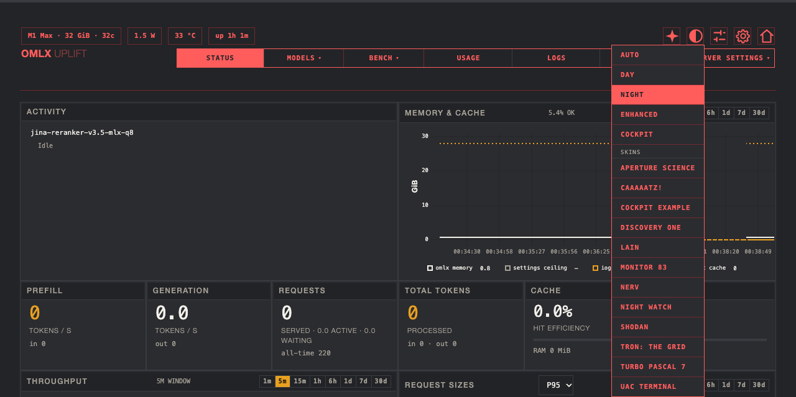
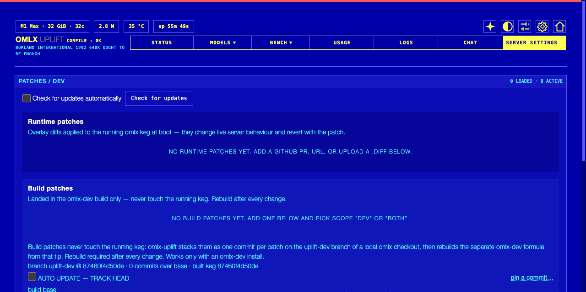
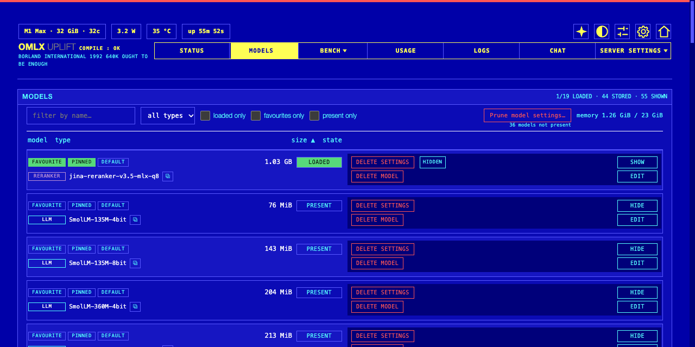
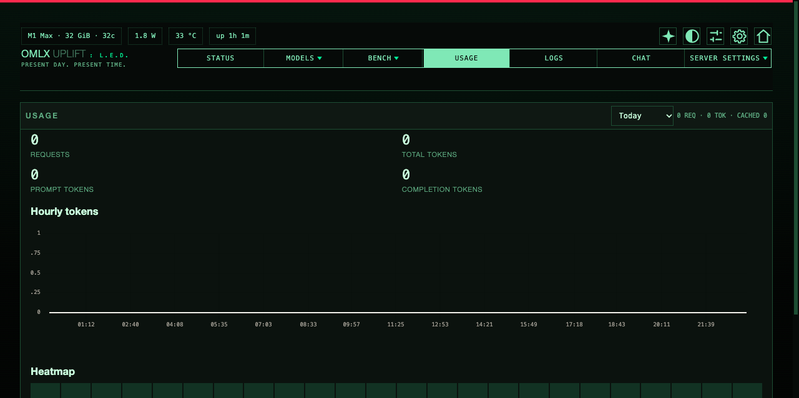

# omlx-uplift

Uplift is an opt-in companion dashboard and metrics layer for
[oMLX](https://github.com/jundot/omlx). It installs as a separate Homebrew
formula (`zviratko/uplift/omlx-uplift`) and never copies code into the omlx
keg: one `.pth` file (`omlx_uplift.pth`) bootstraps `sys.path` and imports
the autopatch hook at interpreter start. The classic `/admin/` dashboard
stays byte-identical and fully working.

```bash
brew tap zviratko/uplift https://github.com/zviratko/omlx-uplift
brew install omlx-uplift
omlx-uplift install                      # writes the ONE .pth into the omlx keg
launchctl kickstart -k gui/$(id -u)/sh.brew.omlx
# open http://127.0.0.1:<omlx-port>/uplift/
```

After `brew upgrade omlx` (fresh keg), re-run `omlx-uplift install` and
kickstart again. Removing uplift: `omlx-uplift uninstall` (removes the
`.pth`), then `brew uninstall omlx-uplift`.

## Releases

`brew install` builds the latest stable tag (v1.0 onward: dependency-
pinned); `brew install --HEAD` tracks `main`. Notable changes per release
are in [CHANGELOG.md](CHANGELOG.md) — add a bullet under `Unreleased`
when your change is user-visible.



*Status board with the theme picker open: four built-in themes plus drop-in
CSS skin crates, previewed on hover, committed on click.*



*Patches / DEV page (TRON skin): runtime and build patch zones, dev keg
control, add-patch form.*



*Models page (SHODAN skin): filter, chips, per-model settings.*



*Usage page (LAIN skin): token totals, hourly chart, heatmap.*

## Patch carrier (PATCHES page)

Uplift can carry small local patches on top of vanilla oMLX so fixes you
need today (for example open PRs of oMLX) survive vanilla upgrades, with
per-patch version history and rollback. **Rollback never rolls back omlx
itself.**

Declarative model:

- The manifest `~/.omlx/uplift/patches.json` is the only description of
  what should be applied. You may edit it by text while omlx is stopped.
- Nothing writes the keg from the dashboard. Enable, disable, promote,
  rollback and reconcile are bookkeeping; files change only when an
  interpreter with the `.pth` hook boots (the `omlx serve` start, a
  launchd respawn, or `omlx-uplift patch apply` when you want it now).
- When the startup engine really changed files, it re-execs the
  interpreter once before engines start, so the server process never
  imports a half-patched tree.
- Each patch keeps its stored versions (newest 100). Sources are a
  GitHub PR (`repo/N`), any https URL, or an uploaded `.diff`. Every
  candidate passes a strict validation gate first: pure unified-diff
  parse, strict context match against the tree as it will be at apply
  time, `py_compile` / JSON checks. A failed gate stores nothing and
  changes no state. Diffs that touch kernel sources or reach outside the
  keg need an explicit approval (`enable --approve once|always`, or the
  matching dashboard prompt) before auto-apply.

State meanings (PATCHES page chips):

| state | meaning |
|---|---|
| `applied` | desired version is live in the keg (verified byte-exact) |
| `pending` | will apply at the next omlx start |
| `update_available` | source drifted; a validated candidate awaits Promote |
| `needs_review` | apply failed (usually after a vanilla upgrade) and oMLX runs WITHOUT the patch until you resolve it |
| `obsolete` | upstream now contains the change; consider Remove |
| `disabled` | files are restored to vanilla bytes |

Rollback semantics:

- Does: point the patch back to a previous stored version. Files become
  byte-exact to what they were before (vanilla or the other version) at
  the next omlx restart. Disable and Remove likewise restore pristine
  vanilla bytes, unwinding every applied version's backups newest-first.
- Does NOT: install, downgrade or pin omlx. If a vanilla upgrade moved
  the code under your patch, the patch is marked `needs_review`, never
  forced.

When upstream merges the PR, "Check for updates" reports the patch as
obsolete (all hunks already present). The honest response is Remove,
which restores vanilla bytes.

CLI control, per patch or global:

```bash
omlx-uplift patch status               # JSON view of manifest + verification
omlx-uplift patch add ID --pr repo/N   # or --url U | --file F, optional --scope
omlx-uplift patch enable ID            # --approve once|always if safeguards fire
omlx-uplift patch disable ID           # one patch off, files revert to vanilla
omlx-uplift patch remove ID
omlx-uplift patch apply                # reconcile now (no re-exec)
omlx-uplift patch check                # re-fetch sources, report drift
omlx-uplift patch curated [--sync]     # published catalog (see curated_patches/)
omlx-uplift patch promote ID           # accept the newest validated candidate
omlx-uplift patch rollback ID [--to-v N]  # undo a promote: previous stored
                                       # version becomes desired again
omlx-uplift patch approve ID --approve once|always  # safeguard approval only
omlx-uplift patch update-all           # re-check + adopt every online source
omlx-uplift patch enable-all           # twin of disable-all: sentinel gone,
                                       # flags restored to what it recorded
```

`patch curated --sync` installs the catalog: default tier enabled,
optional tier installed but off. Re-sync never overwrites your decisions.

Kill switches (both mean: boot pristine vanilla, manifest untouched,
verify-only, no writes):

```bash
OMLX_UPLIFT_NO_PATCHES=1 omlx serve    # env kill switch, one launch
touch ~/.omlx/uplift/patches.disabled  # sentinel, until removed
omlx-uplift patch disable-all          # sentinel + disable every patch
```

If a patch set wedges boot, use a kill switch, fix the manifest by hand
(it is plain JSON), run `patch enable-all`, start again. `disable-all` and
`enable-all` touch only the manifest and the sentinel, so they work even when
this python cannot see an omlx package at all — which is the case they exist
for.

## Skins (theming)

The header theme picker offers the four built-in themes plus drop-in CSS
skin crates — single YAML files (palette, fonts, icons, overlay CSS) that
go live on refresh with no restart. The built-in examples ship in
`omlx_uplift/skins-example/`. **Full authoring guide:
[docs/skins.md](docs/skins.md).**

## Terminal UI (`omlx-uplift tui`)

A menu-driven manager for people who live in a terminal — on the dev box, over
ssh, or when the dashboard is unreachable because the very patch you are
trying to undo broke it.

```bash
omlx-uplift tui
```

It is laid out like **Midnight Commander**: a bar of menus along the top
(`Go`, `Patches`, `Catalog`, `Keg`, `Services`, `View`, `Help`), panels that
fill the whole window — overview, patches, curated catalog, omlx-dev keg,
session log — and a function-key legend along the bottom. `F9` or `Alt` plus
the menu letter opens a menu, the arrows walk it, `Enter` runs the highlighted
command, `Esc` closes it. A command that cannot run right now stays visible,
greyed, with the reason — and every menu command acts on the row its panel has
selected, the same way a panel command does.

In a panel: arrows (or `j`/`k`) move, **Enter opens that row's action menu**,
`Tab` and `←`/`→` switch panels, `F3` toggles the detail pane, `F5` re-reads
live state, `T` cycles the theme, `F1` lists the keys, `F10` quits. Mouse
clicks select rows, open menus and run items. The launcher screen (`m`) and
the number keys `1`-`5` still work.

Rows read as sentences, not codes: the name and description on the first line,
the state in words on the second (`applied | enabled | scope omlx | desired v3`),
tinted by how urgent it is. Nothing needs a legend.

The menus are an extra path, never a worse one: number keys `1`-`5` still jump
straight to a screen and every action keeps its letter shortcut.

It adds no capability the CLI does not have and **no policy of its own**: each
action calls the same function the dashboard route calls, or runs the CLI verb
shown on screen, so the two can never disagree about what a button does.

Nothing writes until you confirm it:

- read-only actions (dry-run test, drift check, status refresh) run at once;
- a state change to the patch store asks `y/N`;
- anything that touches **tree bytes, a keg, or a running service** asks you to
  type `YES` on its own line. A stray `y`, an accidental Enter, or a navigation
  key cancels instead. `q` cancels an armed question rather than quitting
  (press it twice to leave).

Every action prints the command it mirrors, so the log screen doubles as a
teaching surface for the CLI.

**Themes:** `default` (your terminal's own colours), `p(doom)` — the SHODAN
dashboard skin in the terminal, void black with laser crimson and ember orange,
`phosphor` (single-hue CRT) and `mono` (no colour, for screenshots and broken
`TERM`s). Truecolour is deliberately not used: it breaks over ssh hops and
remote tmux, which is exactly where this tool gets used. On a 256-colour
terminal that accepts palette writes the themes get their exact RGB; otherwise
the nearest colour is used **and the status line says so** — a silently
mis-coloured warning is worse than an honest fallback. The choice is saved to
`~/.omlx/uplift/tui.json`, kept out of `patches.json` so a cosmetic preference
never rides along with the patch manifest.

Needs a real terminal on stdin and stdout. Piped or redirected use exits 2 and
points at `patch status` / `dev status` instead of writing control codes into
your log.

## Other commands

```bash
omlx-uplift serve                      # wrapper around 'omlx serve'
omlx-uplift view [--api URL]           # standalone viewer for DMG installs
omlx-uplift kernel list|rebuild NAME|restore NAME  # rebuild ONE native
                                       # kernel in the keg after a patch
                                       # touched csrc/ (originals kept in
                                       # kernel-backups/)
omlx-uplift skin compile DIR|decompile YML         # skin crate codecs;
                                       # themes are drop-in CSS crates,
                                       # picked in the header theme menu
omlx-uplift tui                        # menu-driven manager (see above)
omlx-uplift doctor                     # tree vs wheel RECORD census, read-only
omlx-uplift man                        # full man page
```

## Development kegs (`omlx-dev`): when the patch carrier is not enough

The hook mode above (vanilla `omlx` + the `.pth` carrier) is the right
default. Its limits: a diff cannot carry new files, generated code,
custom Metal kernels, or work-in-progress commits that are not a clean
patch yet. Then use the companion formula. `dev install` drives brew for
you (first build `brew install --HEAD zviratko/uplift/omlx-dev`, rebuilds
`brew reinstall`), so no manual brew step is needed:

```bash
omlx-uplift dev bootstrap              # one-time questionnaire (or: --origin URL)
omlx-uplift dev install                # materialize build patches + build the dev keg
```

How it works: your checkout stays pristine (upstream history only).
Uplift composites it with the enabled patch set into the `uplift-dev`
branch and builds a separate keg from that, so you always know which
bytes are running and rollback never touches your checkout. The dev keg
runs as its own service (`sh.brew.omlx-dev`) with its own port and base
path; the stable `omlx` keeps serving alongside it.

What you get over hook mode:

- **Patches as real commits.** The `uplift-dev` branch is a normal git
  branch: new files, docs edits, test changes, kernel work.
  `omlx-uplift dev patches --scope both` lists what is folded in.
- **Arbitrary source, not just releases.** Track any ref (a PR head,
  `upstream/main`, a bisect point) with `dev bootstrap --sync-ref REF`
  and `dev status --fetch` to see drift.
- **Auto-build.** With the toggle on (PATCHES dev card, or
  `omlx-uplift dev auto-build on`) the tracked base commit is remembered;
  when the service boots on an older base it rebuilds the keg in the
  background. Any manual rollback or base-pin turns it off.
- **Keg stash and instant switching.** `dev stash-keg` freezes the
  current keg, `dev use <sha-prefix>` swaps between saved kegs in
  seconds (a bare sha picks the NEWEST build of that commit). Stashes
  are keyed per BUILD — reinstalling at the same commit still keeps the
  outgoing bytes (`HEAD-<sha>_<UTC>`). `dev rollback` returns to the
  last-known-good; `dev prune` trims old stashes (newest 5 kept by
  default; set `keg_stash_keep` in `~/.omlx/uplift/dev.json`, 1..20,
  or pass `--keep N`).
- **Build options** the formula ships without: `dev install
  --with-custom-kernel --with-grammar`.

Rules of thumb: stable driver plus a few upstream-PR diffs stays on
`omlx` + hook mode. Reading, testing or developing omlx source, kernel
or docs changes, PR-bisecting goes to `omlx-dev`. The two are independent
services; you can run both. `omlx-uplift dev status` prints the live
picture and the PATCHES page surfaces the same state.

## Development

Tests live in `tests/` (pytest + node:test). CI (`.github/workflows/
tests.yml`) runs both suites on every push to `main` as an alien-box
fresh-checkout smoke — but `omlx` is not on PyPI
and is Apple-Silicon-bound, so the runner cannot install it: the ~13
tests that exercise omlx internals SKIP there (conftest.py, reason
printed per test). The full run needs the macOS dev box and the keg
interpreter (the only python with fastapi + omlx):

```bash
# one-time helper libs (system python3 lacks pytest)
/opt/homebrew/opt/omlx/libexec/bin/pip install -q --target ~/hermes/TMP/pylibs \
    pytest pytest-asyncio

cd ~/git/omlx-uplift-repo && \
PYTHONPATH=$HOME/hermes/TMP/pylibs:. /opt/homebrew/opt/omlx/libexec/bin/python \
    -m pytest tests -q            # ~540 tests, ~30 s

for f in omlx_uplift/static/*.js; do node --check "$f"; done \
    && node --test tests/*.cjs
# (`node --check a.js b.js` validates ONLY the first argument — never
#  trust the glob form; scripts/nightly-tests.sh loops for the same reason)
```

`PYTHONPATH` must put the clone BEFORE the deployed keg copy, otherwise
tests silently exercise the installed package (confirm with
`python -c "import omlx_uplift; print(omlx_uplift.__file__)"`).
